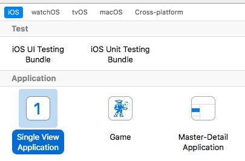
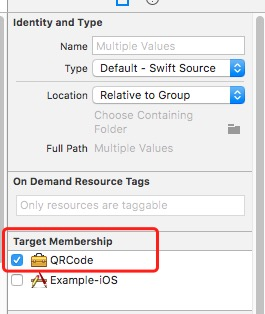
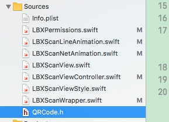
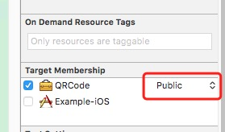
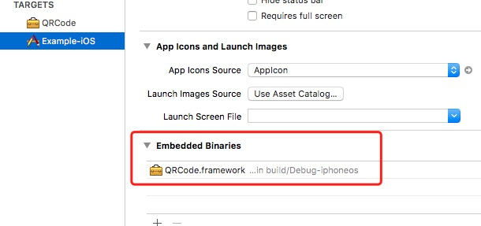

# 创建CocoapodsPrivatePodspec

## 创建Framework项目

## 调整项目文件结构

1. 在项目`根目录`下，参照[QRCode](http://192.168.27.208:8181/software-department-2/iOS.Swift.Library.QRCode)创建和复制文件或文件夹。
2. 在`Sources`目录下放置库文件和`<Your Project Name>`文件夹下的`<Your Project Name>.h`和`Info.plist`。
3. 在`Framework`中添加一个`Example-iOS`的Target。
4. 在`Sources`目录添加库文件,然后选中所有的库文件，在`Utilities`的`Target Menbership`中选中`<Your Framework name>`。
5. 点击`<Your Framework name>.h`文件,然后在`Utilities`的`Target Menbership`中选择`Public`选项。
6. 选中`Example-iOS`Target,在`Embedded Binaries`中添加`<Your Framework name>.framework`。
7. 运行项目，检查是否有问题。
7. 打开`<Your Project Name>.podspec`文件，然后修改其中的内容。
8. 在项目根目录中打开`Terminal`，通过命令`pod lib lint`检验`podspec`文件。
9. 本地库创建完成，可以把库推到`gitlab`，然后`pod`下来检查。

## 参考文章
[使用Cocoapods创建私有podspec](http://www.cocoachina.com/ios/20150228/11206.html)

[Cocoapods官网](https://guides.cocoapods.org/syntax/podspec.html#specification)