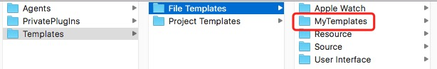
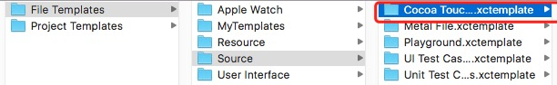
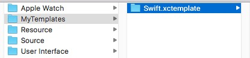
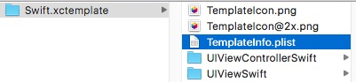
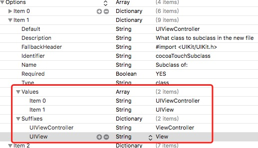

# Xcode模板

## 模板的使用方法
将`MyTemplates`文件夹复制到`Xcode.app`中的**“Contents/Developer/Platforms/iPhoneOS.platform/Developer/Library/Xcode/Templates/File Templates”**文件夹之下

## 模板的新建
可以参照Xcode自带的系统方法，例如CocoaTouch类的文件

将新创建的模板文件夹放在`Swift.xctemplate`文件夹之中

然后在`TemplateInfo.plist`文件中添加新的模板

