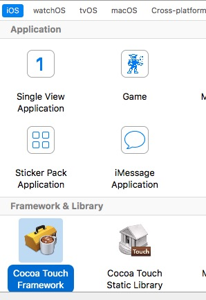
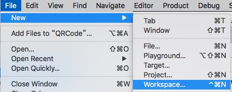
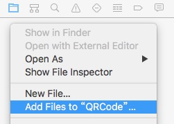
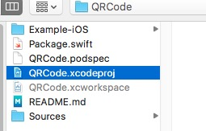
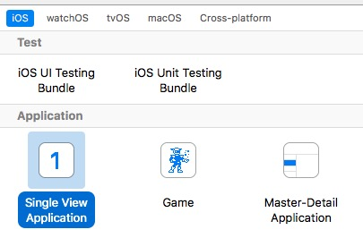
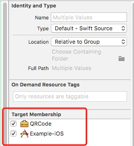

# 创建CocoapodsPrivatePodspec

## 创建Framework项目

## 调整项目文件结构

1. 在项目`根目录`下，参照[QRCode](http://192.168.27.208:8181/software-department-2/iOS.Swift.Library.QRCode)创建和复制文件或文件夹，`*.xcworkspace`文件不要复制
2. 在`Sources`目录下放置库文件和`<Your Project Name>`文件夹下的`<Your Project Name>.h`和`Info.plist`
3. 创建`workspace`文件
4. 在`Workspace`中添加Framework项目
5. 在`Workspace`中添加一个`Example-iOS`的Target
6. 在`Sources`目录添加库文件,然后选中所有的库文件，在`Utilities`的`Target Menbership`中选中`Example-iOS`
7. 打开`<Your Project Name>.podspec`文件，然后修改其中的内容
8. 在项目根目录中打开`Terminal`，通过命令`pod lib lint`检验`podspec`文件

